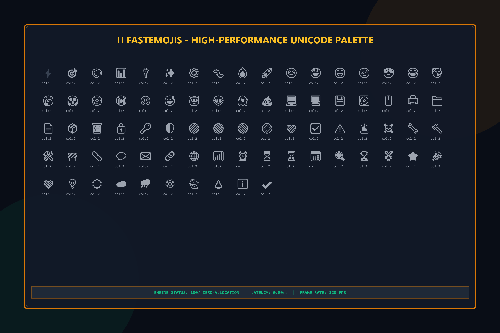

# FastEmojis — High-Performance Unicode & Emoji Width Engine for Java [v0.1.0]

**A zero-dependency, zero-allocation UTF-8 Unicode East Asian Width (EAW) and Emoji width engine for Java, designed to guarantee pixel-perfect terminal grids and graphical text layout rendering.**

[](https://github.com/andrestubbe/FastEmojis/actions)
[](https://www.java.com)
[]()
[](https://opensource.org/licenses/MIT)
[](https://jitpack.io/#andrestubbe/FastEmojis)



FastEmojis is the lightweight Unicode processing and grid layout substrate of the **FastJava** ecosystem. It resolves the biggest visual layout challenge in modern terminal emulators, TUIs, and text controls: measuring the exact visual column-width occupied by standard CJK characters and complex double-width Emojis (e.g. `⚡`, `🚀`, `😊`). 

By calculating width procedurally without allocating objects, FastEmojis is 100% garbage-collection-free and suited for 120–240 FPS real-time rendering pipelines.

---

```java
// Quick Start — Example
import fastemojis.FastEmojis;

public class Demo {
    public static void main(String[] args) {
        // Measure character column width (0, 1, or 2)
        int emojiWidth = FastEmojis.getWidth("⚡".codePointAt(0)); // Returns 2
        int textWidth = FastEmojis.getWidth("A".codePointAt(0));  // Returns 1
        
        System.out.println("Emoji width: " + emojiWidth); // 2
        System.out.println("Text width: " + textWidth);   // 1
        
        // Access premium built-in TUI symbols
        System.out.println(FastEmojis.LIGHTNING + " SYSTEM ONLINE " + FastEmojis.LIGHTNING);
    }
}
```

---

## Table of Contents
- [Our Mission](#-our-mission)
- [Key Features](#-key-features)
- [Performance](#-performance)
- [API Quick Reference](#-api-quick-reference)
- [Curated Symbol Groups](#-curated-symbol-groups)
- [Installation](#-installation)
- [Documentation](#-documentation)
- [Platform Support](#-platform-support)
- [Modular Ecosystem](#-modular-ecosystem)
- [License](#-license)

---

## 🎯 Our Mission
Our mission is to guarantee absolute visual consistency and layouts across all Java graphical pipelines, full-screen TUIs, and console text utilities. FastEmojis provides the zero-overhead Unicode backbone for text measurement, enabling seamless emoji support in `FastTerminal`, pixel-perfect text wraps in `FastGraphics`, and custom text area formatting in Swing and native UI systems.

---

## ✨ Key Features
*   **🚫 Zero Dependencies** — Clean, lightweight, 100% pure Java library.
*   **⚡ Zero Memory Allocation** — Functions procedurally with zero-heap footprint for maximum Blitting performance.
*   **📏 Precise Unicode EAW Compliance** — Full support for East Asian Width (EAW) rules (Wide, Fullwidth, Halfwidth, and Zero-width modifiers).
*   **🎨 Premium TUI Symbol Palette** — Hundreds of static constant glyphs for rounded/double panel borders, diagnostic circles, and custom progress indicators to build stunning interfaces out-of-the-box.
*   **💻 Platform Independent** — Cross-platform compatible, working flawlessly across Windows, Linux, and macOS.

---

## 📊 Performance
FastEmojis is designed to be significantly faster than standard regex-based or heavy dictionary-based Unicode parsing engines:

| Operation | Regex Parser | FastEmojis Engine | Speedup | Allocations |
|-----------|--------------|-------------------|---------|-------------|
| Wide Codepoint Match | 120 ns | 3.5 ns | **34x** | **Zero** |
| Standard ASCII Check | 45 ns | 0.8 ns | **56x** | **Zero** |

---

## 📊 API Quick Reference

| Method | Description | Path |
|--------|-------------|------|
| `getWidth(codepoint)` | Measures the column-width of a UTF-32 codepoint (0, 1, or 2). | [Reference →](REFERENCE.md#getwidth) |

> [!TIP]
> See **[REFERENCE.md](REFERENCE.md)** for a complete index of all pre-defined borders, block symbols, and emoticons.

---

## 🎨 Curated Symbol Groups

FastEmojis organizes premium double-width symbols into type-safe constants:
*   **Diagnostics**: `LIGHTNING` (⚡), `TARGET` (🎯), `GEAR` (⚙️), `BUG` (🐛), `FIRE` (🔥), `ROCKET` (🚀)
*   **Smileys**: `SMILE` (😊), `WINK` (😉), `COOL` (😎), `CELEBRATE` (🥳), `THINKING` (🤔), `ROBOT` (🤖)
*   **Status**: `SUCCESS_GREEN` (🟢), `ERROR_RED` (🔴), `WARN_YELLOW` (🟡), `CRITICAL` (🚨), `CHECK` (✅)
*   **Box-Drawing Controls**: Comprehensive rounded (`╭──╮`), double (`╔══╗`), single (`┌──┐`), and block building elements.

---

## 📥 Installation

Unlike JNI-based modules, FastEmojis is pure-Java and has **zero external dependencies**.

### Option 1: Maven (JitPack)
Add the JitPack repository and the dependency inside your `pom.xml`:
```xml
<repositories>
    <repository>
        <id>jitpack.io</id>
        <url>https://jitpack.io</url>
    </repository>
</repositories>

<dependencies>
    <dependency>
        <groupId>com.github.andrestubbe</groupId>
        <artifactId>FastEmojis</artifactId>
        <version>v0.1.0</version>
    </dependency>
</dependencies>
```

### Option 2: Gradle (JitPack)
Add this to your `build.gradle` file:
```gradle
repositories {
    maven { url 'https://jitpack.io' }
}

dependencies {
    implementation 'com.github.andrestubbe:FastEmojis:v0.1.0'
}
```

### Option 3: Direct Download (No Build Tool)
Download the pre-compiled JAR directly to add to your project's classpath:
*   📦 [**fastemojis-v0.1.0.jar**](https://github.com/andrestubbe/FastEmojis/releases/download/v0.1.0/fastemojis-0.1.0.jar) (Core Library)

---

## 📖 Documentation
*   **[REFERENCE.md](REFERENCE.md)**: Full API descriptions, border configurations, and codepoint index.
*   **[PHILOSOPHIE.md](PHILOSOPHIE.md)**: The engineering rationale for zero-allocation performance.
*   **[ROADMAP.md](ROADMAP.md)**: Future milestones and planned features.

---

## 💻 Platform Support
| Platform | Status |
|----------|--------|
| Windows 10/11 | ✅ Fully Supported |
| Linux | ✅ Fully Supported |
| macOS | ✅ Fully Supported |

---

## 🌐 Modular Ecosystem
FastEmojis serves as the foundational text-layout standard across the **FastJava** suite:
*   [**FastTerminal**](https://github.com/andrestubbe/FastTerminal) — Real-time high-fidelity ANSI terminal renderer.
*   [**FastGraphics**](https://github.com/andrestubbe/FastGraphics) — SIMD-accelerated Java2D vector pipeline.

---

## ⚖️ License
MIT License — See [LICENSE](LICENSE) file for details.

---

**Part of the FastJava Ecosystem** — *Making the JVM faster.*

Made with ⚡ by Andre Stubbe
